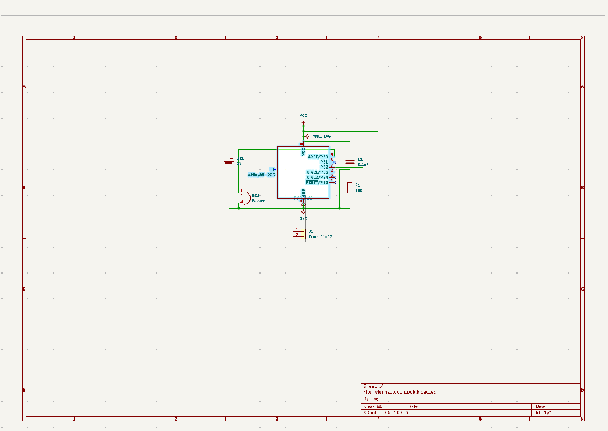
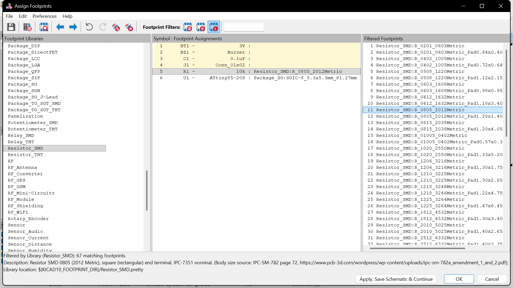
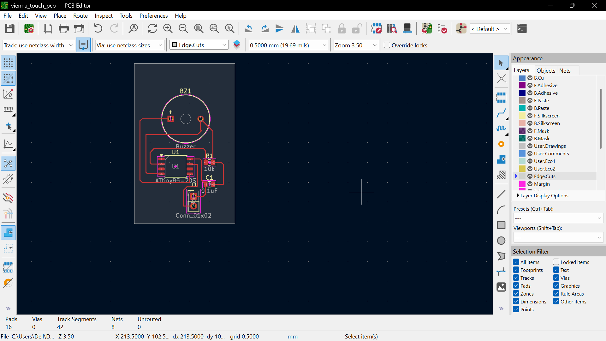
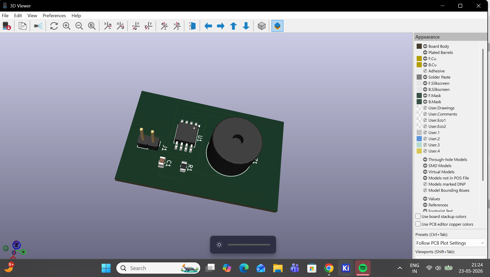

ATtiny85 Buzzer PCB Design
==========================

Overview
--------

This project involved designing a compact PCB using the ATtiny85 microcontroller in KiCad. The board includes a buzzer, passive components, and a connector header. The main objective was to understand the complete PCB design workflow, from schematic creation to Gerber generation.

Tools Used
==========

*   KiCad
    
*   Arduino IDE (planned for programming)
    

Components Used
===============

*   ATtiny85 Microcontroller
    
*   Buzzer
    
*   10k Resistor
    
*   0.1uF Capacitor
    
*   2-pin Header
    

Workflow
========

1\. Schematic Design
--------------------

All required components were placed and connected in the schematic editor. Power symbols and PWR\_FLAG symbols were added to resolve ERC errors.

2\. ERC Validation
------------------

Electrical Rules Check (ERC) was performed to identify:

*   unconnected pins
    
*   missing power connections
    
*   floating nets
    

All issues were corrected before proceeding.

3\. Footprint Assignment
------------------------

Appropriate footprints were assigned to each component:

*   SOIC-8 package for ATtiny85
    
*   SMD resistor and capacitor footprints
    
*   Buzzer footprint
    
*   Connector header footprint
    

4\. PCB Layout and Routing
--------------------------

The schematic was transferred to the PCB editor. Components were arranged compactly and manually routed using copper traces.

A board outline was created using the Edge.Cuts layer.

5\. DRC and 3D Visualization
----------------------------

After routing, Design Rule Check (DRC) was run successfully without errors. The final PCB was also viewed in KiCad’s 3D viewer.

Gerber Generation
=================

Gerber and drill files were generated successfully for PCB fabrication.

Learning Outcomes
=================

Through this project, the following concepts were learned:

*   Schematic design in KiCad
    
*   ERC and DRC validation
    
*   Footprint assignment
    
*   PCB routing
    
*   Board outline creation
    
*   Gerber generation
    
*   Basic PCB workflow
    

Conclusion
==========

This project helped in understanding the practical PCB development process using KiCad. A compact ATtiny85-based PCB was successfully designed, routed, validated, and prepared for manufacturing.
